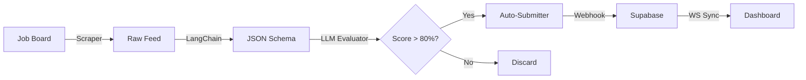
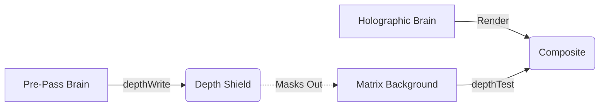
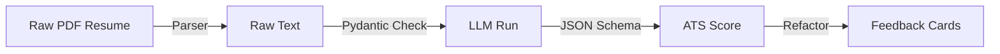
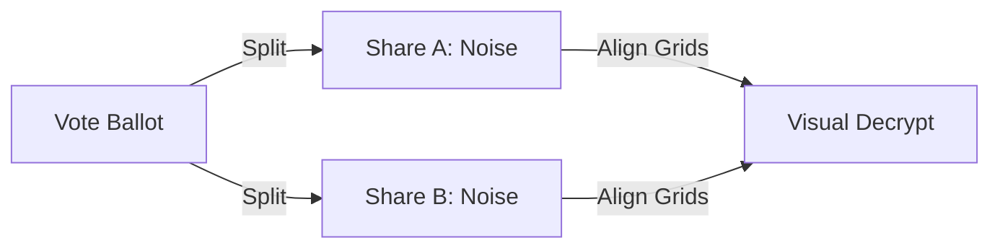
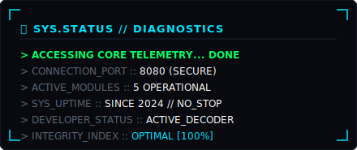

# 🛰️ Rishabh02104 // Cybernetic Systems Directory

<div align="center">
  <!-- Animated Typing SVG Header -->
  
</div>

<p align="center">
  
  
  
</p>

<div align="center">
  <a href="https://rishavendra-os.vercel.app/"></a>
  <a href="https://www.linkedin.com/in/rishavendra-sharma-94b8ba286/"></a>
  <a href="mailto:rishavendrasharma9353@gmail.com"></a>
  <a href="https://github.com/Rishabh02104"></a>
</div>

---

## 🌌 IDENTITY_PORTAL // POSITIONING
> **Builder of Intelligent Systems**  
> Developing autonomous AI-powered products, computer vision architectures, and immersive WebGL graphics consoles.

---

## 🚀 MISSION_MANIFEST // OPERATING_DIRECTIVE

This directory is an engineering logbook. I build complex software systems not to gather repositories, but to understand computer science from the transistors up. Every codebase here is an experiment in scalability, interface responsiveness, and automation intelligence. 

I approach software with a simple rule: **deploy, optimize, and break things to understand how they work.**

---

## 🛰️ RECRUITER_TELEMETRY // QUICK_SCAN

```text
+---------------------------------------------------------------------------------+
| SYSTEM MODULES     :: AI Agent Orchestration, WebGL Engines, Computer Vision    |
| CORE TOOLKIT       :: TypeScript, Python, Go, C++, Next.js, FastAPI, OpenCV     |
| CAREER DIRECTION   :: Software Engineer (SDE 1) // AI Platform Engineer         |
| CORE FOCUS         :: Designing high-fidelity frontends & async python backends  |
| RECRUITER ACTIONS  :: [ rishavendra-os.vercel.app ] // [ rishavendrasharma9353 ]|
+---------------------------------------------------------------------------------+
```

---

## 🛠️ Diagnostics & System Specifications

<div align="center">
  <!-- Custom High-Fidelity HUD Specs SVG -->
  
</div>

---

## 🚀 System Timeline (Development Journey)

<div align="center">
  <!-- Custom visual SVG development timeline -->
  
</div>

---

## 📂 Active System Modules (Projects Blueprint)

<div align="center">
  <!-- Custom Systems Blueprint SVG mapping the 5 projects -->
  
</div>

### 🔗 Module Access Portals (Quick Links)

<div align="center">
  <table width="800" style="border-collapse: collapse; border: 1px solid #121a24; font-family: monospace; background: #06070a; text-align: center;">
    <tr style="background: #0d1117; color: #00E5FF;">
      <th style="padding: 10px; border: 1px solid #121a24;">SYSTEM MODULE</th>
      <th style="padding: 10px; border: 1px solid #121a24;">SOURCE PORTAL</th>
      <th style="padding: 10px; border: 1px solid #121a24;">LIVE DEPLOYMENT</th>
    </tr>
    <tr>
      <td style="padding: 8px; border: 1px solid #121a24; color: #ffffff;"><b>AI_Job_Agent</b></td>
      <td style="padding: 8px; border: 1px solid #121a24;"><a href="https://github.com/Rishabh02104/AI_Job_Agent"><code>[ CODE_REPO ]</code></a></td>
      <td style="padding: 8px; border: 1px solid #121a24;"><a href="https://frontend-two-sigma-88.vercel.app/"><code>[ LIVE_HOST ]</code></a></td>
    </tr>
    <tr>
      <td style="padding: 8px; border: 1px solid #121a24; color: #ffffff;"><b>RishavendraOS</b></td>
      <td style="padding: 8px; border: 1px solid #121a24;"><a href="https://github.com/Rishabh02104/RishavendraOS"><code>[ CODE_REPO ]</code></a></td>
      <td style="padding: 8px; border: 1px solid #121a24;"><a href="https://rishavendra-os.vercel.app"><code>[ LIVE_HOST ]</code></a></td>
    </tr>
    <tr>
      <td style="padding: 8px; border: 1px solid #121a24; color: #ffffff;"><b>CareerForge_AI</b></td>
      <td style="padding: 8px; border: 1px solid #121a24;"><a href="https://github.com/Rishabh02104/Careerforge-ai"><code>[ CODE_REPO ]</code></a></td>
      <td style="padding: 8px; border: 1px solid #121a24;"><a href="https://careerforge-ai-red.vercel.app/"><code>[ LIVE_HOST ]</code></a></td>
    </tr>
    <tr>
      <td style="padding: 8px; border: 1px solid #121a24; color: #ffffff;"><b>drone-binary-terrain-mapping</b></td>
      <td style="padding: 8px; border: 1px solid #121a24;"><a href="https://github.com/Rishabh02104/drone-binary-terrain-mapping"><code>[ CODE_REPO ]</code></a></td>
      <td style="padding: 8px; border: 1px solid #121a24; color: #5a6675;"><code>[ N/A ]</code></td>
    </tr>
    <tr>
      <td style="padding: 8px; border: 1px solid #121a24; color: #ffffff;"><b>secure-voting</b></td>
      <td style="padding: 8px; border: 1px solid #121a24;"><a href="https://github.com/Rishabh02104/secure-voting"><code>[ CODE_REPO ]</code></a></td>
      <td style="padding: 8px; border: 1px solid #121a24;"><a href="https://secure-voting-iota.vercel.app/"><code>[ LIVE_HOST ]</code></a></td>
    </tr>
  </table>
</div>

---

### 🏛️ Module Engineering Deep Dives

#### 🦾 1. AI Job Agent — Autonomous Pipeline
* **Problem:** Manual job applications are labor-intensive, error-prone, and introduce significant latency in hiring loops.
* **Solution:** Built a fully autonomous web agent that scrapes listings, scores CV fit dynamically via LLMs, structures schemas, and auto-submits applications.
* **Architecture:** Python & Playwright browser workers coupled with LangChain orchestrators, syncing to a Next.js cockpit via Supabase real-time webhooks.
* **Technical Challenge:** Parsing unstructured job specs into rigid Pydantic formats while bypassing anti-bot challenge walls and dynamic JavaScript-heavy form fields.
* **Outcome:** Shipped a production-ready application runner that executes automated applications with a >80% relevance matching engine.

#### 🧠 2. RishavendraOS — 3D Cybernetic Portfolio
* **Problem:** Flat developer resumes fail to communicate spatial capabilities, interactive design thinking, or native computer graphics experience.
* **Solution:** Created a WebGL Operating System using interactive point-cloud models where lobe synapses trigger smooth, GSAP-driven viewport camera transitions.
* **Architecture:** React Three Fiber (R3F) + custom GLSL vertex/fragment shaders running on a Next.js framework, overlaying Framer Motion UI containers.
* **Technical Challenge:** Rendering dense particle systems without memory leaks, while executing custom depth pre-passes to render animated matrix rain text behind the primary 3D elements.
* **Outcome:** Shipped a custom operating system interface resolving coordinate math transitions smoothly at a locked 60 FPS on mobile and desktop.

#### 🛠️ 3. CareerForge AI — Structured ATS Pipeline
* **Problem:** Automated Applicant Tracking Systems (ATS) reject qualified candidates due to parser errors or unoptimized resume keyword indexing.
* **Solution:** Engineered an interactive feedback console analyzing PDF resume layout structure and extracting skills metrics to simulate ATS evaluations.
* **Architecture:** Python PDF parser backend feeding structured schemas to OpenAI JSON models, outputting refactoring directives.
* **Technical Challenge:** Aligning diverse resume formats into unified data schemas using strict Pydantic structures.
* **Outcome:** Built a real-time feedback loop providing concrete improvements to candidate profiles.

#### 🛰️ 4. drone-binary-terrain-mapping — Edge CV Scanner
* **Problem:** Standard drone cameras generate high-bandwidth telemetry data that is too heavy for edge devices to process in real-time.
* **Solution:** Designed a computer vision scanner that simulates edge detection, road boundaries estimation, and classification on simulated terrains.
* **Architecture:** OpenCV Python routines estimating metrics from wireframe projection canvases.
* **Technical Challenge:** Managing computational overhead for real-time video frames under noise and drone drift simulation parameters.
* **Outcome:** Successfully simulated boundary estimation metrics with zero cloud dependencies.

#### 🔐 5. secure-voting — Visual Cryptography System
* **Problem:** Digital election systems are vulnerable to single-point server breaches that can leak or alter decrypted ballots.
* **Solution:** Implemented a visual secret sharing ballot tool that splits security codes into two random noise transparency layers, requiring physical alignment to resolve the key.
* **Architecture:** Next.js application core leveraging HTML5 Canvas to execute programmatic pixel-level share slicing and overlay reconstruction.
* **Technical Challenge:** Rendering fractional pixel grids on high-DPI displays to ensure zero subpixel leakage during grid overlap.
* **Outcome:** Built a database-free visual ballot verification system demonstrating cryptographic split-key security.

---

## 🏗️ Core Architecture Pipelines

#### 1. AI Job Agent Application Pipeline


#### 2. RishavendraOS Depth Masking Pipeline (WebGL)


#### 3. CareerForge AI Structured Parsing


#### 4. Secure Voting Share Cryptography


---

## 🛠️ Subsystem Technologies Matrix

<div align="center">
  <!-- Custom Motherboard Slot Tech Stack SVG -->
  
</div>

<br/>

### ⚙️ Systems Engineering Directory

* **Frontend Systems:** React.js, Next.js, Framer Motion, HTML5 Canvas API, Tailwind CSS, Responsive Web Design.
* **Backend Systems:** FastAPI, Python, Node.js, Express, REST APIs, JSON Schemas, Web Sockets.
* **Agentic AI Systems:** LangChain, OpenAI APIs, Pydantic, Web Scraper pipelines, Webhooks, Autonomous Agents.
* **Graphics & Computer Vision:** Three.js, React Three Fiber (R3F), Custom GLSL Shaders, OpenCV, TensorFlow.
* **Infrastructure & Tooling:** Git, GitHub Actions (CI/CD), Supabase, PostgreSQL, Vercel, Bash, PowerShell.

<div align="center">
  <!-- Continuous Skillicons Matrix with ThreeJS added to remove gaps -->
  
</div>

---

## 🧠 ENGINEERING_PHILOSOPHY // DESIGN_CORE

* **Build to Learn:** I do not believe in copying code. True engineering is understanding your dependencies, reading core source files, and writing modules from scratch to truly learn how they work.
* **System-First Design:** Code is ephemeral; system architecture is permanent. I construct modular, decoupled components to ensure scalability, ease of debugging, and architectural stability.
* **Rapid Experimentation:** Break systems to know their limits. Running high-frequency scrapers, benchmark tests, or pushing shader iterations is the fastest path to discovering software performance walls.
* **Clean Code is a Recruiting Asset:** Write code not just for computers to run, but for other engineers to read. Maintain structured directories, consistent naming conventions, and robust documentation.

---

## 🔮 SYSTEM_ROADMAP // FUTURE_RESEARCH

Active research fields under system analysis:
1. **Multi-Agent Collaboration Protocols:** Designing state machines allowing multiple browser-based LLM agents to resolve complex forms in parallel.
2. **WebGL Shaders Optimization:** Tuning fragment shader math to render complex mathematical point clouds efficiently on low-tier mobile hardware.
3. **Real-time Edge Video Processing:** Investigating low-latency neural architectures for video inference using TensorFlow Lite on edge sensors.

---

## 📈 System Metrics & Profile Analytics

Our real-time developer metrics show core developer activity indexes and language distribution parameters.

<div align="center">
  <table border="0" width="100%" style="border-collapse: collapse; border: none; background: transparent;">
    <tr style="border: none; background: transparent;">
      <td width="55%" align="center" style="border: none; background: transparent; padding: 0; vertical-align: top;">
        
      </td>
      <td width="2%" style="border: none; background: transparent; padding: 0;"></td>
      <td width="43%" align="center" style="border: none; background: transparent; padding: 0; vertical-align: top;">
        
      </td>
    </tr>
    <tr style="height: 12px; border: none; background: transparent;"><td colspan="3" style="border: none; padding: 0;"></td></tr>
    <tr style="border: none; background: transparent;">
      <td colspan="3" align="center" style="border: none; background: transparent; padding: 0;">
        
      </td>
    </tr>
  </table>
</div>

---

## 🛠️ WIP Modules (Current Builds)

<div align="center">
  <table width="100%" style="border-collapse: collapse; border: none; font-family: monospace;">
    <tr style="border: none; background: transparent;">
      <td align="center" width="33%" style="border: none; background: transparent; padding: 10px;">
        <b><code>VoxFrame</code></b><br/>
        <br/>
        <br/>
        <i>Gemini Vision subtitle engine</i>
      </td>
      <td align="center" width="33%" style="border: none; background: transparent; padding: 10px;">
        <b><code>AI_Job_Agent</code></b><br/>
        <br/>
        <br/>
        <i>CAPTCHA bypass + resume tailoring</i>
      </td>
      <td align="center" width="33%" style="border: none; background: transparent; padding: 10px;">
        <b><code>RishavendraOS</code></b><br/>
        <br/>
        <br/>
        <i>Shader optimization pass</i>
      </td>
    </tr>
  </table>
</div>

---

```bash
[session_id]  :: rishavendrasharma9353@gmail.com
[port]        :: 8080 — handshake ready
[uptime]      :: building since 2024 — no signs of stopping
[last_commit] :: pushing to main...
```

<div align="center">
  <!-- Custom Animated Telemetry Diagnostics Footer -->
  
</div>

<!-- sys.trigger: force snake update -->
