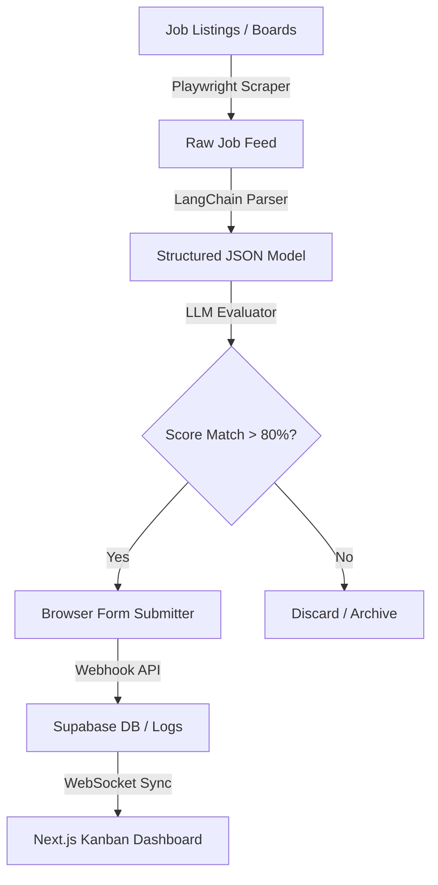
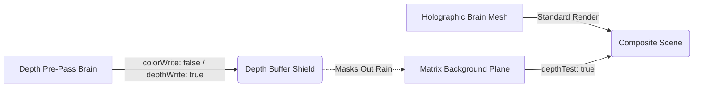

# 💻 [ Rishabh02104 // System Core ]

<div align="center">
  
</div>

<p align="center">
  
  
</p>

<div align="center">
  <code>[boot_log] :: Initializing neural graphics core... establishing secure handshake... connection ok.</code>
</div>

---

<div align="center">
  <table style="border: 1px solid #00D9FF; background-color: #080808; font-family: monospace;">
    <thead>
      <tr>
        <th colspan="2" style="color: #00D9FF; text-align: center;">💻 SYSTEM SPECIFICATIONS</th>
      </tr>
    </thead>
    <tbody>
      <tr>
        <td>👤 <b>Host</b></td>
        <td><code>Rishavendra Sharma (Rishabh02104)</code></td>
      </tr>
      <tr>
        <td>🎓 <b>Core</b></td>
        <td><code>B.Tech Computer Science & Engineering (2026)</code></td>
      </tr>
      <tr>
        <td>🐚 <b>Shell</b></td>
        <td><code>zsh / bash / powershell</code></td>
      </tr>
      <tr>
        <td>⏱️ <b>Uptime</b></td>
        <td><code>Continuous learning & system optimization</code></td>
      </tr>
      <tr>
        <td>⚙️ <b>Current Process</b></td>
        <td><code>Agentic AI & Volumetric Renderers</code></td>
      </tr>
      <tr>
        <td>🚀 <b>Status</b></td>
        <td></td>
      </tr>
      <tr>
        <td>🛠️ <b>Build</b></td>
        <td></td>
      </tr>
    </tbody>
  </table>
</div>

<div align="center">
  
</div>

* 🔭 **Building AI-powered platforms** — focusing on agentic browser automations and real-time WebGL canvas integrations.
* 🧠 **Specializing in Agentic AI pipelines, Computer Vision architectures, and 3D web rendering**.
* 🏗️ **Engineering clean codebases** — using Next.js for high-fidelity frontends and FastAPI for optimized, async python backends.
* 🔗 Check out my interactive portfolio OS at **[rishavendra-os.vercel.app](https://rishavendra-os.vercel.app)**.
* 📫 Reach me at **[rishavendrasharma9353@gmail.com](mailto:rishavendrasharma9353@gmail.com)**.
* ⚡ Shipped 5 production-grade platforms spanning WebGL rendering, resume parsing technology, and web crawler automation.

---

## 🚀 Active Project Modules

┌─[ MODULE: AI_Job_Agent ]──────────────────────────────┐
│ CLASSIFICATION: Autonomous Agentic Automation         │
│ STATUS: Active                                        │
│ STACK: FastAPI, LangChain, Next.js, Supabase, Python  │
├──────────────────────────────────────────────────────┤
│ CORE FUNCTIONS:                                      │
│  ▹ Match-scores CVs against listings with embeddings │
│  ▹ Playwright listings crawler with proxy rotations  │
│  ▹ Automates form filling & browser submissions      │
├──────────────────────────────────────────────────────┤
│ ENGINEERING CHALLENGE → FIX                         │
│  🔧 Playwright CAPTCHAs & Throttling                 │
│  → Rotated headers, random viewports & Supabase logs │
├──────────────────────────────────────────────────────┤
│ [View Repo](https://github.com/Rishabh02104/AI_Job_Agent) • [Live Demo](https://github.com/Rishabh02104/AI_Job_Agent) │
└──────────────────────────────────────────────────────┘

┌─[ MODULE: RishavendraOS ]─────────────────────────────┐
│ CLASSIFICATION: WebGL Interactive OS                  │
│ STATUS: Stable                                        │
│ STACK: Next.js, Three.js, Framer Motion, Javascript   │
├──────────────────────────────────────────────────────┤
│ CORE FUNCTIONS:                                      │
│  ▹ 3D point-cloud brain synapse navigation system    │
│  ▹ Depth pre-pass masks prevent Matrix rain background │
│  ▹ Fluid camera lookAt LERPs driven by GSAP physics  │
├──────────────────────────────────────────────────────┤
│ ENGINEERING CHALLENGE → FIX                         │
│  🔧 Matrix text bleeding through transparent brain   │
│  → Double-pass depth buffer masking shader pre-pass  │
├──────────────────────────────────────────────────────┤
│ [View Repo](https://github.com/Rishabh02104/RishavendraOS) • [Live Demo](https://rishavendra-os.vercel.app) │
└──────────────────────────────────────────────────────┘

┌─[ MODULE: CareerForge_AI ]────────────────────────────┐
│ CLASSIFICATION: AI Document Intelligence              │
│ STATUS: Stable                                        │
│ STACK: Next.js, TypeScript, Tailwind, OpenAI API      │
├──────────────────────────────────────────────────────┤
│ CORE FUNCTIONS:                                      │
│  ▹ Cross-references CV content for ATS scoring       │
│  ▹ Provides interactive cards with refactor guides   │
│  ▹ Implements modular structured prompt layouts      │
├──────────────────────────────────────────────────────┤
│ ENGINEERING CHALLENGE → FIX                         │
│  🔧 Parsing unstructured PDF text into strict JSON   │
│  → Enforced Pydantic schema validation during LLM run│
├──────────────────────────────────────────────────────┤
│ [View Repo](https://github.com/Rishabh02104/Careerforge-ai) • [Live Demo](https://careerforge-ai-red.vercel.app/) │
└──────────────────────────────────────────────────────┘

┌─[ MODULE: drone-binary-terrain-mapping ]──────────────┐
│ CLASSIFICATION: Computer Vision & Robotics            │
│ STATUS: Stable                                        │
│ STACK: Python, TensorFlow, OpenCV, PyTorch            │
├──────────────────────────────────────────────────────┤
│ CORE FUNCTIONS:                                      │
│  ▹ Binary terrain patch classification on video feeds│
│  ▹ Measures road widths and angles via OpenCV logic  │
│  ▹ Async video thread processing pipeline            │
├──────────────────────────────────────────────────────┤
│ ENGINEERING CHALLENGE → FIX                         │
│  🔧 Variable model scales causing viewport clipping  │
│  → Bounding-box normalizer scales matrices on mount  │
├──────────────────────────────────────────────────────┤
│ [View Repo](https://github.com/Rishabh02104/drone-binary-terrain-mapping) • [Live Demo](https://github.com/Rishabh02104/drone-binary-terrain-mapping) │
└──────────────────────────────────────────────────────┘

┌─[ MODULE: secure-voting ]─────────────────────────────┐
│ CLASSIFICATION: Cryptographic Security                │
│ STATUS: Stable                                        │
│ STACK: JavaScript, HTML5 Canvas, CSS3                 │
├──────────────────────────────────────────────────────┤
│ CORE FUNCTIONS:                                      │
│  ▹ Encrypts vote ballots by splitting into noise shares│
│  ▹ Reconstructs vote output mechanically on grids    │
│  ▹ Requires zero database keys or digital decryption │
├──────────────────────────────────────────────────────┤
│ ENGINEERING CHALLENGE → FIX                         │
│  🔧 High-DPI screen pixel shifts breaking alignment  │
│  → Fixed pixel-ratio canvases locking coordinates    │
├──────────────────────────────────────────────────────┤
│ [View Repo](https://github.com/Rishabh02104/secure-voting) • [Live Demo](https://secure-voting-iota.vercel.app/) │
└──────────────────────────────────────────────────────┘

---

## 🏗️ Core Architecture Showcases

#### 1. AI Job Agent Application Pipeline


#### 2. RishavendraOS Depth Masking Pipeline (WebGL)


---

<div align="center">

**`[ FRONTEND ]`**
<br/>


<br/><br/>

**`[ BACKEND ]`**
<br/>


<br/><br/>

**`[ AI / ML ]`**
<br/>


<br/><br/>

**`[ TOOLING ]`**
<br/>


</div>

---

## 📈 System Metrics & Profile Analytics

<div align="center">
  <table border="0">
    <tr>
      <td width="50%">
        
      </td>
      <td width="50%">
        
      </td>
    </tr>
    <tr>
      <td colspan="2">
        
      </td>
    </tr>
    <tr>
      <td colspan="2">
        
      </td>
    </tr>
    <tr>
      <td colspan="2">
        
      </td>
    </tr>
  </table>
</div>

---

## 🐍 Contribution Grid

<div align="center">
  
</div>

---

## 🛠️ Currently Building (WIP Modules)

<div align="center">
  <table>
    <tr>
      <td align="center" width="33%">
        <b><code>VoxFrame</code></b><br/>
        <br/>
        <br/>
        <i>Gemini Vision subtitle engine</i>
      </td>
      <td align="center" width="33%">
        <b><code>AI_Job_Agent</code></b><br/>
        <br/>
        <br/>
        <i>CAPTCHA bypass + resume tailoring</i>
      </td>
      <td align="center" width="33%">
        <b><code>RishavendraOS</code></b><br/>
        <br/>
        <br/>
        <i>Shader optimization pass</i>
      </td>
    </tr>
  </table>
</div>

---

## 📬 Connect Module

<div align="center">
  <a href="https://rishavendra-os.vercel.app/"></a>
  <a href="https://www.linkedin.com/in/rishavendra-sharma-94b8ba286/"></a>
  <a href="mailto:rishavendrasharma9353@gmail.com"></a>
  <a href="https://github.com/Rishabh02104"></a>
</div>

<br/>

```bash
[session_id]  :: rishavendrasharma9353@gmail.com
[port]        :: 8080 — handshake ready
[uptime]      :: building since 2022 — no signs of stopping
[last_commit] :: pushing to main...
```


