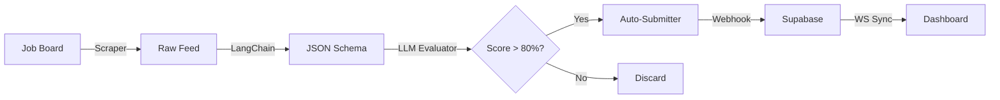
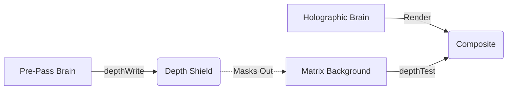
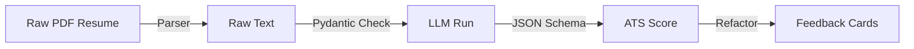
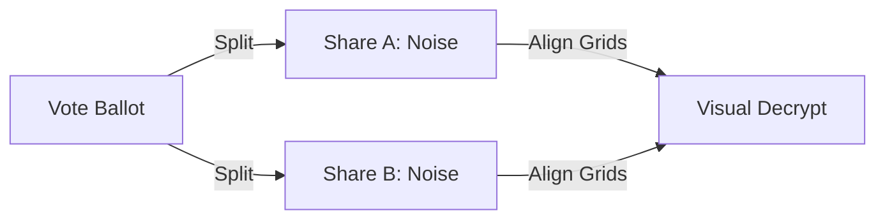
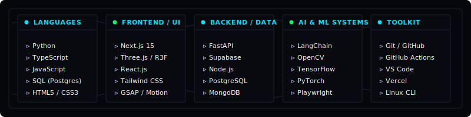
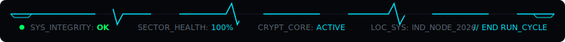

# 🛰️ Rishabh02104 // Cybernetic Systems Directory

<div align="center">
  <!-- Animated Typing SVG Header -->
  
</div>

<p align="center">
  
  
  
</p>

<div align="center">
  <a href="https://rishavendra-os.vercel.app/"></a>
  <a href="https://www.linkedin.com/in/rishavendra-sharma-94b8ba286/"></a>
  <a href="mailto:rishavendrasharma9353@gmail.com"></a>
  <a href="https://github.com/Rishabh02104"></a>
</div>

---

## 🛠️ Diagnostics &amp; System Specifications

<div align="center">
  <!-- Custom High-Fidelity HUD Specs SVG -->
  
</div>

<br/>

* 🔭 **Building AI-powered platforms** — focusing on agentic browser automations and real-time WebGL canvas integrations.
* 🧠 **Specializing in Agentic AI pipelines, Computer Vision architectures, and 3D web rendering**.
* 🏗️ **Engineering clean codebases** — using Next.js for high-fidelity frontends and FastAPI for optimized, async python backends.
* 🔗 Check out my interactive portfolio OS at **[rishavendra-os.vercel.app](https://rishavendra-os.vercel.app)**.
* 📫 Reach me at **[rishavendrasharma9353@gmail.com](mailto:rishavendrasharma9353@gmail.com)**.
* ⚡ Shipped 5 production-grade platforms spanning WebGL rendering, resume parsing technology, and web crawler automation.

---

## 🚀 System Timeline (Development Journey)

<div align="center">
  <!-- Custom visual SVG development timeline -->
  
</div>

---

## 📂 Active System Modules (Projects Blueprint)

<div align="center">
  <!-- Custom Systems Blueprint SVG mapping the 5 projects -->
  
</div>

### 🔗 Module Access Portals (Quick Links)

<div align="center">
  <table width="800" style="border-collapse: collapse; border: 1px solid #121a24; font-family: monospace; background: #06070a; text-align: center;">
    <tr style="background: #0d1117; color: #00E5FF;">
      <th style="padding: 10px; border: 1px solid #121a24;">SYSTEM MODULE</th>
      <th style="padding: 10px; border: 1px solid #121a24;">SOURCE PORTAL</th>
      <th style="padding: 10px; border: 1px solid #121a24;">LIVE DEPLOYMENT</th>
    </tr>
    <tr>
      <td style="padding: 8px; border: 1px solid #121a24; color: #ffffff;"><b>AI_Job_Agent</b></td>
      <td style="padding: 8px; border: 1px solid #121a24;"><a href="https://github.com/Rishabh02104/AI_Job_Agent"><code>[ CODE_REPO ]</code></a></td>
      <td style="padding: 8px; border: 1px solid #121a24;"><a href="https://frontend-two-sigma-88.vercel.app/"><code>[ LIVE_HOST ]</code></a></td>
    </tr>
    <tr>
      <td style="padding: 8px; border: 1px solid #121a24; color: #ffffff;"><b>RishavendraOS</b></td>
      <td style="padding: 8px; border: 1px solid #121a24;"><a href="https://github.com/Rishabh02104/RishavendraOS"><code>[ CODE_REPO ]</code></a></td>
      <td style="padding: 8px; border: 1px solid #121a24;"><a href="https://rishavendra-os.vercel.app"><code>[ LIVE_HOST ]</code></a></td>
    </tr>
    <tr>
      <td style="padding: 8px; border: 1px solid #121a24; color: #ffffff;"><b>CareerForge_AI</b></td>
      <td style="padding: 8px; border: 1px solid #121a24;"><a href="https://github.com/Rishabh02104/Careerforge-ai"><code>[ CODE_REPO ]</code></a></td>
      <td style="padding: 8px; border: 1px solid #121a24;"><a href="https://careerforge-ai-red.vercel.app/"><code>[ LIVE_HOST ]</code></a></td>
    </tr>
    <tr>
      <td style="padding: 8px; border: 1px solid #121a24; color: #ffffff;"><b>drone-binary-terrain-mapping</b></td>
      <td style="padding: 8px; border: 1px solid #121a24;"><a href="https://github.com/Rishabh02104/drone-binary-terrain-mapping"><code>[ CODE_REPO ]</code></a></td>
      <td style="padding: 8px; border: 1px solid #121a24; color: #5a6675;"><code>[ N/A ]</code></td>
    </tr>
    <tr>
      <td style="padding: 8px; border: 1px solid #121a24; color: #ffffff;"><b>secure-voting</b></td>
      <td style="padding: 8px; border: 1px solid #121a24;"><a href="https://github.com/Rishabh02104/secure-voting"><code>[ CODE_REPO ]</code></a></td>
      <td style="padding: 8px; border: 1px solid #121a24;"><a href="https://secure-voting-iota.vercel.app/"><code>[ LIVE_HOST ]</code></a></td>
    </tr>
  </table>
</div>

---

## 🏗️ Core Architecture Pipelines

#### 1. AI Job Agent Application Pipeline


#### 2. RishavendraOS Depth Masking Pipeline (WebGL)


#### 3. CareerForge AI Structured Parsing


#### 4. Secure Voting Share Cryptography


---

## 🛠️ Subsystem Technologies Matrix

<div align="center">
  <!-- Custom Motherboard Slot Tech Stack SVG -->
  
</div>

<br/>

<div align="center">
  <!-- Continuous Skillicons Matrix with ThreeJS added to remove gaps -->
  
</div>

---

## 📈 System Metrics & Profile Analytics

<div align="center">
  <table border="0" width="100%" style="border-collapse: collapse; border: none; background: transparent;">
    <tr style="border: none; background: transparent;">
      <td width="55%" align="left" style="border: 1px solid #121a24; background: #090a0f; padding: 16px; border-radius: 8px; font-family: monospace; color: #ffffff; vertical-align: top;">
        <div style="color: #00E5FF; font-weight: bold; margin-bottom: 8px; font-size: 14px; letter-spacing: 1px;">🛰️ SYS.STATUS // DIAGNOSTICS</div>
        <div style="font-size: 12px; line-height: 1.5; color: #00FF66; font-family: monospace;">
          &gt; ACCESSING CORE TELEMETRY... DONE<br/>
          <span style="color: #ffffff;">&gt; CONNECTION_PORT   :: 8080 (SECURE)</span><br/>
          <span style="color: #ffffff;">&gt; ACTIVE_MODULES    :: 5 OPERATIONAL</span><br/>
          <span style="color: #ffffff;">&gt; SYS_UPTIME        :: SINCE 2024 // NO_STOP</span><br/>
          <span style="color: #ffffff;">&gt; DEVELOPER_STATUS  :: ACTIVE_DECODER</span><br/>
          <span style="color: #00E5FF;">&gt; INTEGRITY_INDEX   :: OPTIMAL [100%]</span>
        </div>
      </td>
      <td width="45%" align="center" style="border: 1px solid #121a24; background: #090a0f; padding: 12px; border-radius: 8px; vertical-align: top;">
        <div style="color: #00E5FF; font-weight: bold; margin-bottom: 8px; font-size: 14px; letter-spacing: 1px; font-family: monospace; text-align: left;">🧠 CORE_LANGUAGES</div>
        
      </td>
    </tr>
    <tr style="height: 12px; border: none; background: transparent;"><td colspan="2" style="border: none; padding: 0;"></td></tr>
    <tr style="border: none; background: transparent;">
      <td colspan="2" align="center" style="border: 1px solid #121a24; background: #090a0f; padding: 16px; border-radius: 8px;">
        <div style="color: #00E5FF; font-weight: bold; margin-bottom: 12px; font-size: 14px; letter-spacing: 1px; font-family: monospace; text-align: left;">📊 ACTIVITY_INDEX // 30_DAY_TELEMETRY</div>
        
      </td>
    </tr>
    <tr style="height: 12px; border: none; background: transparent;"><td colspan="2" style="border: none; padding: 0;"></td></tr>
    <tr style="border: none; background: transparent;">
      <td colspan="2" align="center" style="border: 1px solid #121a24; background: #090a0f; padding: 16px; border-radius: 8px;">
        <div style="color: #00E5FF; font-weight: bold; margin-bottom: 12px; font-size: 14px; letter-spacing: 1px; font-family: monospace; text-align: left;">📅 SYS.CONTRIBUTION_GRID // LIVE_TELEMETRY</div>
        
      </td>
    </tr>
  </table>
</div>

---

## 🐍 Contribution Grid

<div align="center">
  
</div>

---

## 🛠️ WIP Modules (Current Builds)

<div align="center">
  <table width="100%" style="border-collapse: collapse; border: none; font-family: monospace;">
    <tr style="border: none; background: transparent;">
      <td align="center" width="33%" style="border: none; background: transparent; padding: 10px;">
        <b><code>VoxFrame</code></b><br/>
        <br/>
        <br/>
        <i>Gemini Vision subtitle engine</i>
      </td>
      <td align="center" width="33%" style="border: none; background: transparent; padding: 10px;">
        <b><code>AI_Job_Agent</code></b><br/>
        <br/>
        <br/>
        <i>CAPTCHA bypass + resume tailoring</i>
      </td>
      <td align="center" width="33%" style="border: none; background: transparent; padding: 10px;">
        <b><code>RishavendraOS</code></b><br/>
        <br/>
        <br/>
        <i>Shader optimization pass</i>
      </td>
    </tr>
  </table>
</div>

---

```bash
[session_id]  :: rishavendrasharma9353@gmail.com
[port]        :: 8080 — handshake ready
[uptime]      :: building since 2024 — no signs of stopping
[last_commit] :: pushing to main...
```

<div align="center">
  <!-- Custom Animated Telemetry Diagnostics Footer -->
  
</div>

<!-- sys.trigger: force snake update -->
