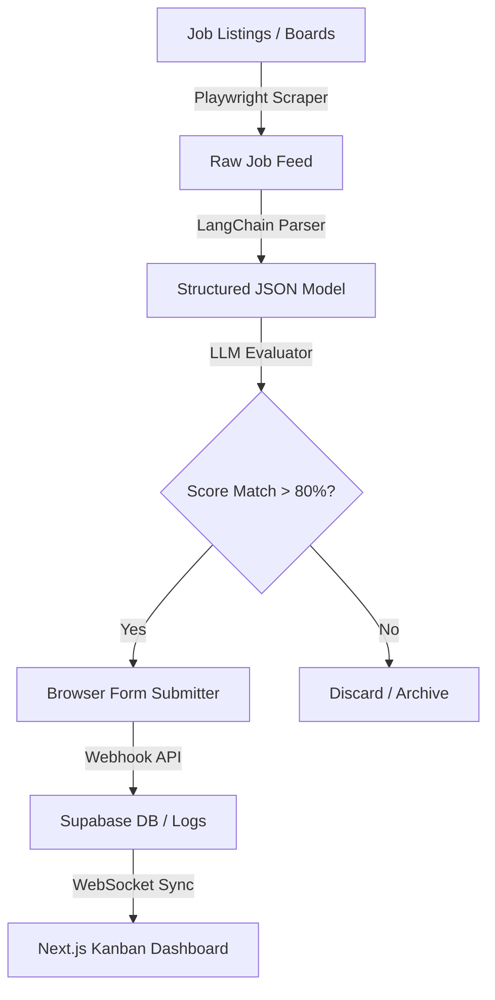
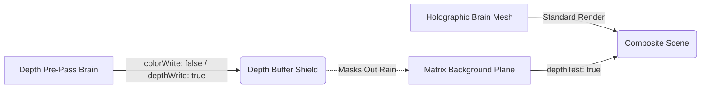

# 💻 [ Rishabh02104 // System Core ]

<div align="center">
  
</div>

<p align="center">
  
  
</p>

<div align="center">
  <code>[boot_log] :: Initializing neural graphics core... establishing secure handshake... connection ok.</code>
</div>

---

```text
┌────────────────────────────────────────────────────────┐
│ SYSTEM SPECIFICATIONS & Core Kernel                    │
├────────────────────────────────────────────────────────┤
│ HOST: Rishavendra Sharma (Rishabh02104)                │
│ CORE: B.Tech Computer Science & Engineering (2026)     │
│ SHELL: zsh / bash / powershell                         │
│ UPTIME: Continuous learning & optimization             │
│ RAM: 1.02 TB (Virtual Cognitive Matrix)                │
│ CURRENT_PROCESS: Agentic AI & Volumetric Renderers     │
│ CURRENT_BUILD: VoxFrame + AI_Job_Agent v2              │
│ STATUS: Actively seeking SDE-1 roles                   │
└────────────────────────────────────────────────────────┘
```

---

```text
┌─[ SKILL MODULE INDEX ]─────────────────────────────────┐
│                                                        │
│ [FRONTEND]                                             │
│ ▹ Next.js • React • TypeScript • JS • Tailwind • Motion │
│                                                        │
│ [BACKEND]                                              │
│ ▹ Python • FastAPI • Supabase (Postgres) • Node • SQL  │
│                                                        │
│ [AI/ML]                                                │
│ ▹ TensorFlow • PyTorch • OpenCV • LangChain • Scrapers  │
│                                                        │
│ [TOOLING]                                              │
│ ▹ Git • GitHub Actions • Docker • VS Code • Vercel     │
└────────────────────────────────────────────────────────┘
```

<div align="center">
  
</div>

---

## 🚀 Active Project Modules

┌─[ MODULE: AI_Job_Agent ]──────────────────────────────┐
│ CLASSIFICATION: Autonomous Agentic Automation         │
│ STATUS: Active                                        │
│ STACK: FastAPI, LangChain, Next.js, Supabase, Python  │
├──────────────────────────────────────────────────────┤
│ CORE FUNCTIONS:                                      │
│  ▹ Match-scores CVs against listings with embeddings │
│  ▹ Playwright listings crawler with proxy rotations  │
│  ▹ Automates form filling & browser submissions      │
├──────────────────────────────────────────────────────┤
│ ENGINEERING CHALLENGE → FIX                         │
│  🔧 Playwright CAPTCHAs & Throttling                 │
│  → Rotated headers, random viewports & Supabase logs │
├──────────────────────────────────────────────────────┤
│ [View Repo](https://github.com/Rishabh02104/AI_Job_Agent) • [Live Demo](https://github.com/Rishabh02104/AI_Job_Agent) │
└──────────────────────────────────────────────────────┘

┌─[ MODULE: RishavendraOS ]─────────────────────────────┐
│ CLASSIFICATION: WebGL Interactive OS                  │
│ STATUS: Stable                                        │
│ STACK: Next.js, Three.js, Framer Motion, Javascript   │
├──────────────────────────────────────────────────────┤
│ CORE FUNCTIONS:                                      │
│  ▹ 3D point-cloud brain synapse navigation system    │
│  ▹ Depth pre-pass masks prevent Matrix rain background │
│  ▹ Fluid camera lookAt LERPs driven by GSAP physics  │
├──────────────────────────────────────────────────────┤
│ ENGINEERING CHALLENGE → FIX                         │
│  🔧 Matrix text bleeding through transparent brain   │
│  → Double-pass depth buffer masking shader pre-pass  │
├──────────────────────────────────────────────────────┤
│ [View Repo](https://github.com/Rishabh02104/RishavendraOS) • [Live Demo](https://rishavendra-os.vercel.app) │
└──────────────────────────────────────────────────────┘

┌─[ MODULE: CareerForge_AI ]────────────────────────────┐
│ CLASSIFICATION: AI Document Intelligence              │
│ STATUS: Stable                                        │
│ STACK: Next.js, TypeScript, Tailwind, OpenAI API      │
├──────────────────────────────────────────────────────┤
│ CORE FUNCTIONS:                                      │
│  ▹ Cross-references CV content for ATS scoring       │
│  ▹ Provides interactive cards with refactor guides   │
│  ▹ Implements modular structured prompt layouts      │
├──────────────────────────────────────────────────────┤
│ ENGINEERING CHALLENGE → FIX                         │
│  🔧 Parsing unstructured PDF text into strict JSON   │
│  → Enforced Pydantic schema validation during LLM run│
├──────────────────────────────────────────────────────┤
│ [View Repo](https://github.com/Rishabh02104/Careerforge-ai) • [Live Demo](https://careerforge-ai-red.vercel.app/) │
└──────────────────────────────────────────────────────┘

┌─[ MODULE: drone-binary-terrain-mapping ]──────────────┐
│ CLASSIFICATION: Computer Vision & Robotics            │
│ STATUS: Stable                                        │
│ STACK: Python, TensorFlow, OpenCV, PyTorch            │
├──────────────────────────────────────────────────────┤
│ CORE FUNCTIONS:                                      │
│  ▹ Binary terrain patch classification on video feeds│
│  ▹ Measures road widths and angles via OpenCV logic  │
│  ▹ Async video thread processing pipeline            │
├──────────────────────────────────────────────────────┤
│ ENGINEERING CHALLENGE → FIX                         │
│  🔧 Variable model scales causing viewport clipping  │
│  → Bounding-box normalizer scales matrices on mount  │
├──────────────────────────────────────────────────────┤
│ [View Repo](https://github.com/Rishabh02104/drone-binary-terrain-mapping) • [Live Demo](https://github.com/Rishabh02104/drone-binary-terrain-mapping) │
└──────────────────────────────────────────────────────┘

┌─[ MODULE: secure-voting ]─────────────────────────────┐
│ CLASSIFICATION: Cryptographic Security                │
│ STATUS: Stable                                        │
│ STACK: JavaScript, HTML5 Canvas, CSS3                 │
├──────────────────────────────────────────────────────┤
│ CORE FUNCTIONS:                                      │
│  ▹ Encrypts vote ballots by splitting into noise shares│
│  ▹ Reconstructs vote output mechanically on grids    │
│  ▹ Requires zero database keys or digital decryption │
├──────────────────────────────────────────────────────┤
│ ENGINEERING CHALLENGE → FIX                         │
│  🔧 High-DPI screen pixel shifts breaking alignment  │
│  → Fixed pixel-ratio canvases locking coordinates    │
├──────────────────────────────────────────────────────┤
│ [View Repo](https://github.com/Rishabh02104/secure-voting) • [Live Demo](https://secure-voting-iota.vercel.app/) │
└──────────────────────────────────────────────────────┘

---

## 🏗️ Core Architecture Showcases

#### 1. AI Job Agent Application Pipeline


#### 2. RishavendraOS Depth Masking Pipeline (WebGL)


---

## 📈 System Metrics & Profile Analytics

<div align="center">
  <table border="0">
    <tr>
      <td width="50%">
        
      </td>
      <td width="50%">
        
      </td>
    </tr>
    <tr>
      <td colspan="2">
        
      </td>
    </tr>
    <tr>
      <td colspan="2">
        
      </td>
    </tr>
    <tr>
      <td colspan="2">
        
      </td>
    </tr>
  </table>
</div>

---

## 🐍 Contribution Grid

<div align="center">
  
</div>

---

## 🛠️ Currently Building (WIP Modules)

```text
VoxFrame        ████████░░  80% — Gemini Vision subtitle engine
AI_Job_Agent    ██████░░░░  60% — CAPTCHA bypass + resume tailoring
RishavendraOS   █████████░  90% — Shader optimization pass
```

---

## 📬 Connect Module

<p align="center">
  <a href="https://rishavendra-os.vercel.app/"></a>
  <a href="https://www.linkedin.com/in/rishavendra-sharma-94b8ba286/"></a>
  <a href="mailto:rishavendrasharma9353@gmail.com"></a>
  <a href="https://github.com/Rishabh02104"></a>
</p>

```text
========================================================================
[session_id] :: rishavendrasharma9353@gmail.com
[status] :: port 8080 open — ready to collaborate
[uptime] :: building since 2022 — no signs of stopping
========================================================================
```
