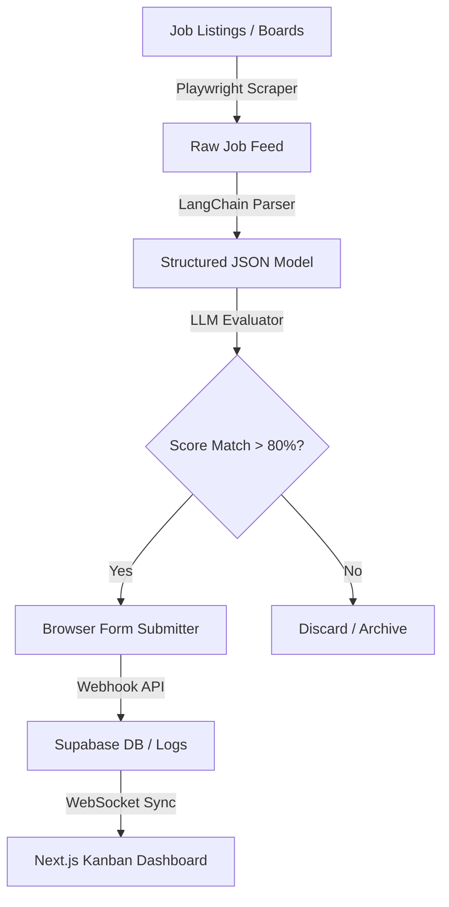
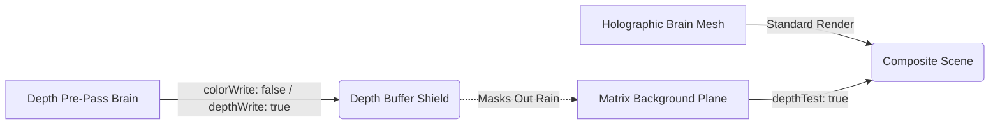

```text
      ___           ___           ___                       ___           ___           ___                       ___     
     /\  \         /\  \         /\  \                     /\  \         /\  \         /\  \                     /\  \    
    /::\  \       /::\  \        \::\  \                   /::\  \       /::\  \       /::\  \                   /::\  \   
   /:/\:\  \     /:/\:\  \        \::\  \                 /:/\:\  \     /:/\:\  \     /:/\:\  \                 /:/\:\  \  
  /::\~\:\  \   /::\~\:\  \       /::\  \                /::\~\:\  \   /::\~\:\  \   /::\~\:\  \               /::\~\:\  \ 
 /:/\:\ \:\__\ /:/\:\ \:\__\     /:/\:\__\              /:/\:\ \:\__\ /:/\:\ \:\__\ /:/\:\ \:\__\             /:/\:\ \:\__\
 \/__\:\/:/  / \/__\:\/:/  /    /:/  \/__/              \/__\:\/:/  / \/_|::\/:/  / \/_|::\/:/  /             \/__\:\/:/  /
      \::/  /       \::/  /    /:/  /                        \::/  /     |:|::/  /     |:|::/  /                   \::/  / 
      /:/  /        /:/  /     \/__/                         /:/  /      |:|:/  /      |:|:/  /                    /:/  /  
     /:/  /        /:/  /                                   /:/  /       |:|/  /       |:|/  /                    /:/  /   
     \/__/         \/__/                                    \/__/        \|/__/        \|/__/                     \/__/    
```

<div align="center">
  
</div>

<p align="center">
  <a href="https://rishavendra-os.vercel.app/"></a>
  <a href="https://www.linkedin.com/in/rishavendra-sharma-94b8ba286/"></a>
  <a href="mailto:rishavendrasharma9353@gmail.com"></a>
</p>

<p align="center">
  
  
  
</p>

---

### 💻 System Specifications (neofetch --portfolio)

```text
rishavendra@os-core
-------------------
Host: Rishavendra Sharma (Rishabh02104)
OS: RishavendraOS v2.5.0 (Three.js / React Three Fiber / WebGL)
Kernel: Next.js 16.2.7 (Turbopack Engine)
Uptime: Continuous learning & system optimization
Shell: zsh / bash / powershell
CPU: Neural Pipelines (OpenCV, PyTorch, CNNs)
Memory: Context Windows (LangChain, OpenAI API, Supabase vector databases)
Dev Quote: "AI should augment developer capabilities, not replace them. We build tools, not toys."
```

* 🔭 **Building AI-powered platforms** — focusing on agentic browser automations and real-time WebGL canvas integrations.
* 🧠 **Specializing in Agentic AI pipelines, Computer Vision architectures, and 3D web rendering**.
* 🏗️ **Engineering clean codebases** — using Next.js for high-fidelity frontends and FastAPI for optimized, async python backends.
* 🔗 Check out my interactive portfolio OS at **[rishavendra-os.vercel.app](https://rishavendra-os.vercel.app)**.
* 📫 Reach me at **[rishavendrasharma9353@gmail.com](mailto:rishavendrasharma9353@gmail.com)**.
* ⚡ Shipped 5 production-grade platforms spanning WebGL rendering, resume parsing technology, and web crawler automation.

---

### 🎯 Development Roadmap & Activity

| Target Domain | Status | Technical Details |
| :--- | :--- | :--- |
| 🔨 **Currently Building** | **AI Job Agent v2** | Structuring multi-agent task loops using LangGraph, handling persistent browser state caching |
| 🧪 **Experimenting With** | **Custom WebGL Shaders** | Volume post-processing filters, depth-buffer masking, and procedural particle physics |
| 📚 **Currently Learning** | **WebGPU & Infrastructure** | Porting WebGL vertex/fragment pipelines to WebGPU; standardizing Docker/Kubernetes container steps |
| 🤝 **Open To** | **Opportunities** | AI/ML engineering, Full-stack developer roles, and specialized systems automation contracts |
| 💬 **Ask Me About** | **My Stack** | React, Next.js, R3F, FastAPI, Playwright automation, and vector database integrations |

---

### 🚀 Featured Projects — Technical Deep Dive

#### 🤖 [AI Job Agent](https://github.com/Rishabh02104/AI_Job_Agent)
*Autonomous job search, match scoring, and browser application pipeline*
* **Stack**: `FastAPI` • `LangChain` • `Next.js` • `Supabase` • `Playwright` • `Python`
* **Key Feature**: Dynamic matching of resume profiles against live job descriptions using vector embeddings and structured LLM validators.
* **🔧 Technical Challenge & Resolution**: 
  * *Challenge*: Playwright automation getting blocked by CAPTCHA challenges and rate-limit triggers.
  * *Resolution*: Implemented header rotation middleware, randomized browser viewport setups, and structured persistent context session storage using Supabase to resume failed runs smoothly.

#### 🧠 [RishavendraOS](https://github.com/Rishabh02104/RishavendraOS)
*WebGL-powered 3D cybernetic portfolio operating system*
* **Stack**: `Next.js` • `React Three Fiber (R3F)` • `Three.js` • `Framer Motion` • `JavaScript`
* **Key Feature**: Interactive point-cloud brain navigation leveraging custom vertex and fragment shaders.
* **🔧 Technical Challenge & Resolution**:
  * *Challenge*: The falling matrix rain background (a flat 2D canvas texture mapped behind the model) bleeding through transparent brain vertices.
  * *Resolution*: Programmed a double-pass depth buffer masking setup. A clone of the brain model renders first with depth writing enabled but color output disabled (`colorWrite: false`, `depthWrite: true`), acting as an invisible shield that masks out background elements behind the brain point cloud.

#### 📄 [CareerForge AI](https://github.com/Rishabh02104/Careerforge-ai)
*AI-powered resume scanner and ATS optimization coach*
* **Stack**: `Next.js` • `TypeScript` • `Tailwind CSS` • `OpenAI API` • `Supabase`
* **Key Feature**: OpenAI-driven structured rating validator that grades resume formats and profiles against real job descriptions.
* **🔧 Technical Challenge & Resolution**:
  * *Challenge*: Parsing unstructured PDF resume text layouts into consistent JSON schemas.
  * *Resolution*: Designed a multi-stage parser parsing text feeds via raw extraction blocks and verifying it against strict Pydantic models during the OpenAI prompt evaluation stage.

#### 🛸 [drone-binary-terrain-mapping](https://github.com/Rishabh02104/drone-binary-terrain-mapping)
*CNN patch terrain classification and road metrics estimation system*
* **Stack**: `Python` • `TensorFlow` • `OpenCV` • `PyTorch`
* **Key Feature**: Real-time road dimension, angle, and width metric calculations from aerial video streams.
* **🔧 Technical Challenge & Resolution**:
  * *Challenge*: Inconsistent scale factors and coordinate metrics of drone GLTF meshes causing viewport clipping on mount.
  * *Resolution*: Built a custom bounding-box normalizer script that calculates coordinates and scales the model matrix dynamically on load to a standard `1.4` size.

#### 🔐 [secure-voting](https://github.com/Rishabh02104/secure-voting)
*Visual cryptography-based secret-sharing voting system concept*
* **Stack**: `JavaScript` • `HTML5 Canvas` • `CSS3`
* **Key Feature**: Mechanical decryption of votes using aligned overlay transparency grids.
* **🔧 Technical Challenge & Resolution**:
  * *Challenge*: Perfect pixel alignment of transparency shares on variable DPI screens.
  * *Resolution*: Developed a responsive canvas rendering system that locks coordinates to absolute device pixels, preventing layout stretching and blur.

---

### 🏗️ Architecture Showcases

#### 1. AI Job Agent Application Pipeline


#### 2. RishavendraOS Depth Masking Pipeline (WebGL)


---

### 📊 GitHub Analytics

<p align="center">
  
</p>

<p align="center">
  
</p>

---

### 🛠️ Tech Stack & Tooling

#### 💻 Languages & Core


#### 🎨 Frontend & 3D Web


#### ⚙️ Backend, Databases & Cloud


#### 🤖 AI, Machine Learning & Automation


#### 🔧 DevOps, Tools & IDEs


---

### 📬 Let's Connect

* 🌐 **Portfolio**: **[rishavendra-os.vercel.app](https://rishavendra-os.vercel.app)**
* 💼 **LinkedIn**: **[Rishavendra Sharma](https://www.linkedin.com/in/rishavendra-sharma-94b8ba286/)**
* 📧 **Email**: **[rishavendrasharma9353@gmail.com](mailto:rishavendrasharma9353@gmail.com)**
