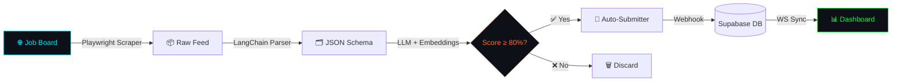
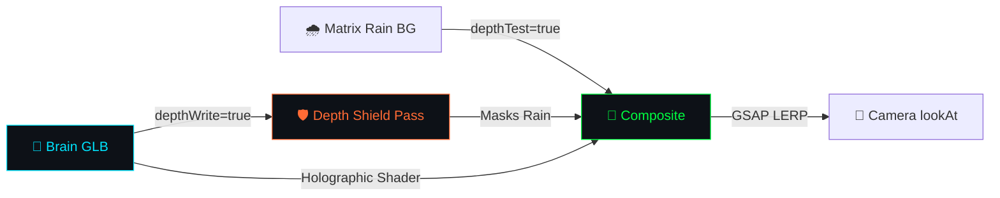
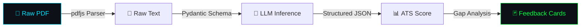
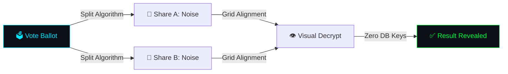

<div align="center">


<br/>


<br/><br/>

<a href="https://rishavendra-os.vercel.app/"></a>
<a href="https://www.linkedin.com/in/rishavendra-sharma-94b8ba286/"></a>
<a href="mailto:rishavendrasharma9353@gmail.com"></a>
<a href="https://github.com/Rishabh02104"></a>

</div>


---

## ⚙️ SYSTEM SPECIFICATIONS

<div align="center">

| PARAMETER | VALUE |
|:---|:---|
| 🖥️ **HOST** | Rishavendra Sharma · `Rishabh02104` |
| 🎓 **CORE** | B.Tech Computer Science & Engineering · 2026 |
| 🐚 **SHELL** | `zsh` · `bash` · `powershell` |
| ⏱️ **UPTIME** | Continuous learning & optimization |
| 🧠 **RAM** | 1.02 TB *(Virtual Cognitive Matrix)* |
| ⚡ **CURRENT_PROCESS** | Agentic AI Systems · Volumetric WebGL Renderers |
| 🏗️ **CURRENT_BUILD** | `VoxFrame` + `AI_Job_Agent v2` |
| 📡 **STATUS** |  |

</div>


---

## 🛠️ SUBSYSTEM TECHNOLOGY MATRIX

<div align="center">

**`[ FRONTEND CORE ]`**


**`[ BACKEND & DATABASE ]`**


**`[ AI / ML / VISION ]`**


<br/>


**`[ TOOLING & DEPLOYMENT ]`**


<br/>


</div>


---

## 🚀 ACTIVE PROJECT MODULES

<div align="center">

### `[ MODULE_01 // AI_Job_Agent ]`
#### 🤖 Autonomous Agentic Job Application Pipeline


| FUNCTION | DETAIL |
|:---|:---|
| 🎯 CV Scoring | Match-scores resumes against listings using pgvector embeddings + LLM checkers |
| 🕷️ Crawler | Playwright listings scraper with user-agent rotation & header bypass |
| 🤖 Automation | Automates form filling & browser-driven submissions end-to-end |
| 🔧 **Challenge** | Playwright CAPTCHA blocks & rate-limit throttling |
| ✅ **Fix** | Rotated headers, randomized viewports, Supabase session tracking |

[](https://github.com/Rishabh02104/AI_Job_Agent)
[](https://frontend-two-sigma-88.vercel.app/)

</div>

---

<div align="center">

### `[ MODULE_02 // RishavendraOS ]`
#### 🧠 WebGL Interactive 3D Portfolio OS


| FUNCTION | DETAIL |
|:---|:---|
| 🧠 Navigation | Holographic point-cloud brain synapse navigation with custom shaders |
| 🎭 Masking | Depth pre-pass masks prevent Matrix rain from bleeding through brain mesh |
| 🎥 Camera | Fluid `lookAt` LERPs driven by GSAP physics engine |
| 🔧 **Challenge** | Matrix text bleeding through transparent brain mesh at runtime |
| ✅ **Fix** | Double-pass shader — depth buffer mask renders first, then scene composite |

[](https://github.com/Rishabh02104/RishavendraOS)
[](https://rishavendra-os.vercel.app)

</div>

---

<div align="center">

### `[ MODULE_03 // CareerForge_AI ]`
#### 📄 AI Document Intelligence & Career Platform


| FUNCTION | DETAIL |
|:---|:---|
| 📊 ATS Scoring | Cross-references CV content against job descriptors for ATS match scoring |
| 🃏 Feedback Cards | Interactive action cards with step-by-step refactor suggestions |
| 🧩 Prompt Engine | Modular structured prompt layouts for accurate LLM parsing |
| 🔧 **Challenge** | Parsing unstructured PDF layouts into consistent JSON schemas |
| ✅ **Fix** | Strict Pydantic validators enforced during the LLM inference stage |

[](https://github.com/Rishabh02104/Careerforge-ai)
[](https://careerforge-ai-red.vercel.app/)

</div>

---

<div align="center">

### `[ MODULE_04 // drone-binary-terrain-mapping ]`
#### 🛸 Computer Vision & Robotics Engine


| FUNCTION | DETAIL |
|:---|:---|
| 🗺️ Classification | Patch-based binary CNN classification (Road/Non-Road) on live drone feeds |
| 📐 Metric Conversion | Computes real-world length, area, & coverage using altitude & FOV projections |
| ⚡ CV Analytics | Estimates road width, angle & offset dynamically via custom OpenCV masks |
| 🔧 **Challenge** | Pixel-to-metric scaling errors due to flight altitude fluctuations |
| ✅ **Fix** | Dynamic scaling projection formula calibrated using drone altitude metrics |

[](https://github.com/Rishabh02104/drone-binary-terrain-mapping)

</div>

---

<div align="center">

### `[ MODULE_05 // secure-voting ]`
#### 🔐 Visual Cryptography Prototype


| FUNCTION | DETAIL |
|:---|:---|
| 🔒 Encryption | Encrypts vote ballots by splitting graphic image data into noise shares |
| 🔓 Decryption | Reconstructs vote output mechanically by aligning visual share overlays |
| 🛡️ Zero-Key | Requires zero database keys or digital decryption algorithms |
| 🔧 **Challenge** | Pixel shifts on high-DPI screens breaking alignment grids |
| ✅ **Fix** | Fixed pixel-ratio canvases locking coordinates to device pixels |

[](https://github.com/Rishabh02104/secure-voting)
[](https://secure-voting-iota.vercel.app/)

</div>

---

<div align="center">

### `[ MODULE_06 // VoxFrame ]`
#### 🎬 Video Caption Design Studio & AI Suggestion Engine


| FUNCTION | DETAIL |
|:---|:---|
| 👁️ Scene Analysis | Claude 3.5 Sonnet analyzes video frames to suggest contextual caption text |
| 🎵 Speech Decoding | Groq Whisper transcribes voice feeds word-by-word with accurate timestamps |
| 🎨 Frame Editor | Figma-like panel styling per-card (fonts, shadow, background, canvas overlays) |
| 🔧 **Challenge** | Client-side video compiling and canvas text drag-and-drop boundary collisions |
| ✅ **Fix** | Captured canvas frame streams dynamically using MediaRecorder into WebM blobs |

[](https://github.com/Rishabh02104/VoxFrame)

</div>


---

## 🏗️ CORE ARCHITECTURE PIPELINES

#### `[ PIPELINE_01 ]` AI Job Agent — Autonomous Application Flow



#### `[ PIPELINE_02 ]` RishavendraOS — WebGL Depth Masking



#### `[ PIPELINE_03 ]` CareerForge AI — Resume Intelligence



#### `[ PIPELINE_04 ]` Secure Voting — Visual Cryptography



#### `[ PIPELINE_05 ]` VoxFrame — Video Caption Design Studio & AI Suggestion Flow


---

## 📈 SYSTEM METRICS & PROFILE ANALYTICS

<div align="center">


<br/><br/>


<br/><br/>


<br/><br/>

### `[ ACTIVE REPOSITORY CONTRIBUTION MATRIX ]`

| MODULE | TARGET REPOSITORY | COMPLETED COMMITS | KEY CONTRIBUTIONS | STATUS |
|:---|:---|:---|:---|:---|
| **MODULE_01** | [`AI_Job_Agent`](https://github.com/Rishabh02104/AI_Job_Agent) | `18 Commits` | Playwright scrapper, CAPTCHA bypass, Supabase sync | `Active` |
| **MODULE_02** | [`RishavendraOS`](https://github.com/Rishabh02104/RishavendraOS) | `24 Commits` | 3D synapse nav, depth pre-pass shader masking, GSAP camera LERPs | `Active` |
| **MODULE_03** | [`CareerForge_AI`](https://github.com/Rishabh02104/Careerforge-ai) | `12 Commits` | ATS scoring engine, structured JSON LLM parsing, prompt tuning | `Completed` |
| **MODULE_04** | [`drone-binary-terrain-mapping`](https://github.com/Rishabh02104/drone-binary-terrain-mapping) | `8 Commits` | Patch-based binary CNN classification, dynamic altitude scaling | `Completed` |
| **MODULE_05** | [`secure-voting`](https://github.com/Rishabh02104/secure-voting) | `6 Commits` | Visual cryptography split algorithm, canvas pixel-ratio locking | `Completed` |
| **MODULE_06** | [`VoxFrame`](https://github.com/Rishabh02104/VoxFrame) | `20 Commits` | Rebuilt Video Caption Design Studio, Claude Vision, WebM encoder | `Active` |

</div>


---

## 🐍 CONTRIBUTION GRID

<div align="center">

<picture>
  <source media="(prefers-color-scheme: dark)" srcset="https://raw.githubusercontent.com/Rishabh02104/Rishabh02104/output/github-snake-dark.svg?v=3" />
  <source media="(prefers-color-scheme: light)" srcset="https://raw.githubusercontent.com/Rishabh02104/Rishabh02104/output/github-snake.svg?v=3" />
  
</picture>

</div>


---

## 🛠️ WIP MODULES — CURRENT BUILDS

<div align="center">

<table border="0" width="100%">
<tr>
<td align="center" width="33%">

### `VoxFrame`


**Stack:** Next.js · Groq Whisper · Claude Vision · Canvas

*Video caption design studio — AI suggestions meet per-card styling and WebM burn-in export*

[](https://github.com/Rishabh02104/VoxFrame)

</td>
<td align="center" width="33%">

### `AI_Job_Agent`


**Stack:** FastAPI · Playwright · Supabase · Groq Llama

*CAPTCHA bypass layer + intelligent resume tailoring per job listing*

[](https://github.com/Rishabh02104/AI_Job_Agent)

</td>
<td align="center" width="33%">

### `RishavendraOS`


**Stack:** Next.js · Three.js · R3F · GSAP

*Final shader optimization pass — performance tuning for mobile WebGL*

[](https://github.com/Rishabh02104/RishavendraOS)

</td>
</tr>
</table>

</div>


---

## 📬 CONNECT MODULE

<div align="center">

<a href="https://rishavendra-os.vercel.app/"></a>
<a href="https://www.linkedin.com/in/rishavendra-sharma-94b8ba286/"></a>
<a href="mailto:rishavendrasharma9353@gmail.com"></a>
<a href="https://github.com/Rishabh02104"></a>

<br/><br/>

```bash
╔══════════════════════════════════════════════════════════════════╗
║  [session_id]  :: rishavendrasharma9353@gmail.com               ║
║  [port]        :: 8080 — handshake ready                        ║
║  [stack]       :: Next.js · FastAPI · Three.js · Groq · CV      ║
║  [uptime]      :: building since 2022 — no signs of stopping    ║
║  [last_commit] :: release/voxframe-v2.0.0-stable                ║
║  [status]      :: OPEN TO SDE-1 ROLES — immediate joiner        ║
╚══════════════════════════════════════════════════════════════════╝
```

</div>


