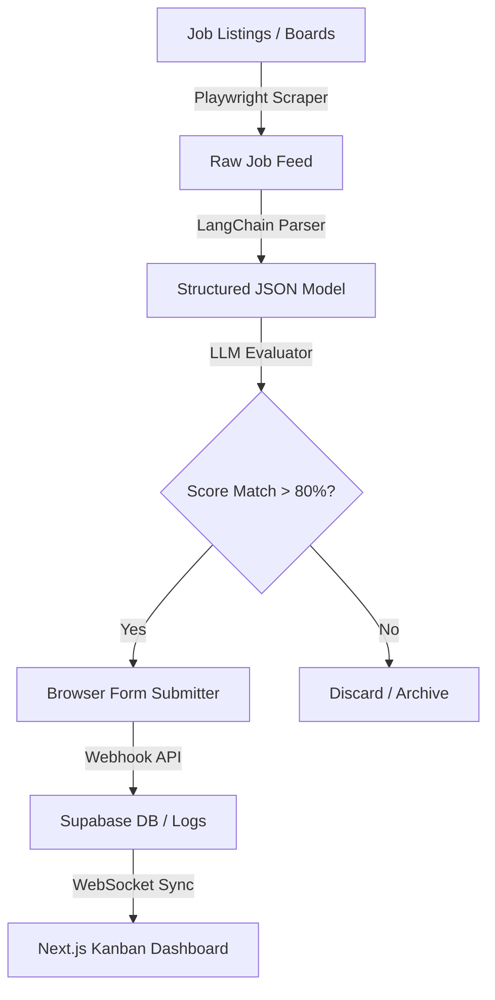
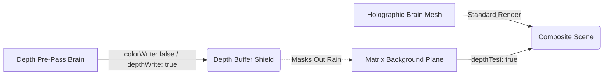

# 💻 [ Rishabh02104 // System Core ]

<div align="center">
  
</div>

<p align="center">
  <a href="https://rishavendra-os.vercel.app/"></a>
  <a href="https://www.linkedin.com/in/rishavendra-sharma-94b8ba286/"></a>
  <a href="mailto:rishavendrasharma9353@gmail.com"></a>
</p>

```text
┌────────────────────────────────────────────────────────┐
│ SYSTEM SPECIFICATIONS & STATUS                         │
├────────────────────────────────────────────────────────┤
│ Host: Rishavendra Sharma (Rishabh02104)                │
│ Core: AI Developer / Full-Stack Builder                │
│ Shell: zsh / bash / powershell                         │
│ Uptime: Continuous learning & optimization             │
│ Current Focus: Autonomous Agent Systems & WebGL Engine │
└────────────────────────────────────────────────────────┘
```

* 🔭 **Building AI-powered platforms** — focusing on agentic browser automations and real-time WebGL canvas integrations.
* 🧠 **Specializing in Agentic AI pipelines, Computer Vision architectures, and 3D web rendering**.
* 🏗️ **Engineering clean codebases** — using Next.js for high-fidelity frontends and FastAPI for optimized, async python backends.
* 🔗 Check out my interactive portfolio OS at **[rishavendra-os.vercel.app](https://rishavendra-os.vercel.app)**.
* 📫 Reach me at **[rishavendrasharma9353@gmail.com](mailto:rishavendrasharma9353@gmail.com)**.
* ⚡ Shipped 5 production-grade platforms spanning WebGL rendering, resume parsing technology, and web crawler automation.

---

## 🚀 System Projects & Active Modules

### 📁 MODULE: AI_Job_Agent
```text
┌──────────────────────────────────────────────────────────────────────────┐
│ AI_Job_Agent :: AUTONOMOUS PIPELINE                                      │
├──────────────────────────────────────────────────────────────────────────┤
│ Stack: FastAPI, LangChain, Next.js, Supabase, Playwright, Python         │
│                                                                          │
│ ▹ Match-scores CVs against listings with embeddings and LLM checkers     │
│ ▹ Playwright listings crawler with user-agent / header rotation bypass   │
│ ▹ Automates form filling & browser-driven submissions                    │
├──────────────────────────────────────────────────────────────────────────┤
│ 🔧 Challenge: Playwright rate-limit blocks and CAPTCHA interceptors      │
│ 🔧 Fix: Rotated headers, randomized viewports, Supabase session tracking│
└──────────────────────────────────────────────────────────────────────────┘
```
* **Repository Link**: [AI_Job_Agent](https://github.com/Rishabh02104/AI_Job_Agent)

### 📁 MODULE: RishavendraOS
```text
┌──────────────────────────────────────────────────────────────────────────┐
│ RishavendraOS :: WEBGL GRAPHICS CORE                                     │
├──────────────────────────────────────────────────────────────────────────┤
│ Stack: Next.js, React Three Fiber (R3F), Three.js, Framer Motion, JS     │
│                                                                          │
│ ▹ Holographic point-cloud brain synapse navigation with custom shaders   │
│ ▹ Depth pre-pass masks prevent Matrix rain background from bleeding      │
│ ▹ Smooth camera lookAt LERPs driven by GreenSock GSAP physics            │
├──────────────────────────────────────────────────────────────────────────┤
│ 🔧 Challenge: Real-time background Matrix text showing through brain mesh│
│ 🔧 Fix: Double-pass shader rendering depth buffer mask first             │
└──────────────────────────────────────────────────────────────────────────┘
```
* **Repository Link**: [RishavendraOS](https://github.com/Rishabh02104/RishavendraOS)

### 📁 MODULE: CareerForge_AI
```text
┌──────────────────────────────────────────────────────────────────────────┐
│ CareerForge_AI :: RESUME PROCESSING MODULE                               │
├──────────────────────────────────────────────────────────────────────────┤
│ Stack: Next.js, TypeScript, Tailwind CSS, OpenAI API, Supabase           │
│                                                                          │
│ ▹ Cross-references CV content with job descriptors for ATS scoring       │
│ ▹ Provides interactive action cards with step-by-step suggestions        │
│ ▹ Implements modular prompt structures for accurate parsing              │
├──────────────────────────────────────────────────────────────────────────┤
│ 🔧 Challenge: Parsing unstructured PDF layouts into consistent JSON data │
│ 🔧 Fix: Strict Pydantic validators during the LLM inference stage        │
└──────────────────────────────────────────────────────────────────────────┘
```
* **Repository Link**: [Careerforge-ai](https://github.com/Rishabh02104/Careerforge-ai)

### 📁 MODULE: drone-binary-terrain-mapping
```text
┌──────────────────────────────────────────────────────────────────────────┐
│ drone-binary-terrain-mapping :: COMPUTER VISION ENGINE                   │
├──────────────────────────────────────────────────────────────────────────┤
│ Stack: Python, TensorFlow, OpenCV, PyTorch                               │
│                                                                          │
│ ▹ Binary terrain patch classification on live video feeds                │
│ ▹ Measures road widths, angles, and offsets using custom OpenCV logic    │
│ ▹ Async video thread processing pipeline                                 │
├──────────────────────────────────────────────────────────────────────────┤
│ 🔧 Challenge: Variable models scale causes viewport clipping on render   │
│ 🔧 Fix: Bounding-box normalizer script scales matrices on mount          │
└──────────────────────────────────────────────────────────────────────────┘
```
* **Repository Link**: [drone-binary-terrain-mapping](https://github.com/Rishabh02104/drone-binary-terrain-mapping)

### 📁 MODULE: secure-voting
```text
┌──────────────────────────────────────────────────────────────────────────┐
│ secure-voting :: CRYPTOGRAPHIC PROTOTYPE                                 │
├──────────────────────────────────────────────────────────────────────────┤
│ Stack: JavaScript, HTML5 Canvas, CSS3                                    │
│                                                                          │
│ ▹ Encrypts vote ballots by splitting graphic image data into noise shares│
│ ▹ Reconstructs vote output mechanically by aligning visual share overlays│
│ ▹ Requires zero database keys or digital decryption algorithms           │
├──────────────────────────────────────────────────────────────────────────┤
│ 🔧 Challenge: Pixel shifts on high-DPI screens breaking alignment grids  │
│ 🔧 Fix: Fixed pixel-ratio canvases locking alignment to device pixels    │
└──────────────────────────────────────────────────────────────────────────┘
```
* **Repository Link**: [secure-voting](https://github.com/Rishabh02104/secure-voting)

---

## 🏗️ Core Architecture Showcases

#### 1. AI Job Agent Application Pipeline


#### 2. RishavendraOS Depth Masking Pipeline (WebGL)


---

## 🛠️ System Module Index (Tech Stack)

```text
📁 [MODULE // CORE LANGUAGES] ── Python • TypeScript • JavaScript • SQL • HTML5 • CSS3
📁 [MODULE // FRAMEWORKS & UI] ── React.js • Next.js • Three.js • R3F • Tailwind CSS • Framer Motion
📁 [MODULE // BACKEND & DATABASE] ── FastAPI • Node.js • Supabase • PostgreSQL • MongoDB • Vercel
📁 [MODULE // ML & AUTOMATION] ── LangChain • TensorFlow • OpenCV • PyTorch • Playwright
📁 [MODULE // TOOLKIT & SYSTEM] ── Git • GitHub Actions • VS Code
```

---

## 📈 System Metrics & Profile Analytics

### 🗺️ Commit & Activity Analytics
<p align="center">
  
</p>

### 📊 Repository Stats & Languages
<p align="center">
  
  
</p>

### 🔥 Contribution Streak
<p align="center">
  
</p>

---

```text
========================================================================
[session_established] :: rishavendrasharma9353@gmail.com
[os_core] :: connection secure, listening on port 8080
========================================================================
```
