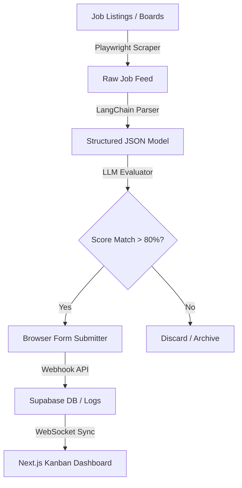

# 🌌 Rishavendra Sharma

<div align="center">
  
</div>

<p align="center">
  <a href="https://rishavendra-os.vercel.app/"></a>
  <a href="https://www.linkedin.com/in/rishavendra-sharma-94b8ba286/"></a>
  <a href="mailto:rishavendrasharma9353@gmail.com"></a>
</p>

<p align="center">
  
  
  
</p>

---

### 🧑‍💻 About Me

```yaml
name: Rishavendra Sharma
location: India
roles:
  - AI Developer / Full-Stack Builder
  - Agentic AI Researcher
  - Computer Science & Engineering Student
currently_building: Autonomous Agent Pipelines & 3D Interactive WebGL OS
portfolio: https://rishavendra-os.vercel.app/
contact: rishavendrasharma9353@gmail.com
```

* 🔭 **Building AI-powered platforms** — from autonomous job application pipelines to WebGL-based cybernetic interfaces.
* 🧠 **Passionate about Agentic AI, Computer Vision, and 3D Web Graphics**.
* 🏗️ **Love architecting full-stack applications** with Next.js, React Three Fiber, and FastAPI cloud integrations.
* 🔗 Check out my interactive portfolio OS at **[rishavendra-os.vercel.app](https://rishavendra-os.vercel.app)**.
* 📫 Reach me at **[creativesimulation1@gmail.com](mailto:creativesimulation1@gmail.com)** or **[rishavendrasharma9353@gmail.com](mailto:rishavendrasharma9353@gmail.com)**.
* ⚡ Shipped production-grade platforms spanning WebGL, resume tech, and automation crawlers.

---

### 🎯 What I'm Working On

| Category | Status | Details |
| :--- | :--- | :--- |
| 🔨 **Currently Building** | **AI Job Agent v2** | Adding multi-agent LangGraph orchestration and dynamic form field schemas |
| 🧪 **Experimenting With** | **GLSL Shaders & WebGL** | Custom shader materials, volume post-processing filters, and depth buffer masking |
| 📚 **Currently Learning** | **WebGPU & Distributed Systems** | Transitioning WebGL structures to WebGPU and containerizing FastAPI backends |
| 🤝 **Open To** | **Roles & Projects** | Full-stack developer roles, AI/ML engineering, and agentic automation design |
| 💬 **Ask Me About** | **My Stack** | React, Next.js, R3F, FastAPI, Playwright scrapers, and prompt engineering |

---

### 💡 How I Build

> "Ship fast, iterate faster. Bridge the gap between raw machine intelligence and fluid user interaction."
>
> "Architectures should be modular and auto-scaling. A clean foundation today saves refactoring tomorrow."
>
> "Interactive graphics bring data to life. 3D in the browser changes how we perceive and navigate software."

---

### 🚀 Featured Projects

#### 🤖 [AI Job Agent](https://github.com/Rishabh02104/AI_Job_Agent)
*Autonomous job search, match scoring, and browser application pipeline*
* **Stack**: `FastAPI` • `LangChain` • `Next.js` • `Supabase` • `Playwright` • `Python`
* **Features**:
  * Scrapes listings dynamically across job portals using custom Playwright and BeautifulSoup scripts.
  * Evaluates listings against user profiles using LangChain and OpenAI structured schema validators.
  * Automates form filing, matches CV fields, and auto-submits job applications.

#### 🧠 [RishavendraOS](https://github.com/Rishabh02104/RishavendraOS)
*WebGL-powered 3D cybernetic portfolio operating system*
* **Stack**: `Next.js` • `React Three Fiber (R3F)` • `Three.js` • `Framer Motion` • `JavaScript`
* **Features**:
  * Holographic point-cloud brain synapse navigation system built with custom GLSL shaders.
  * Watermark Matrix rain background integrated directly in 3D space utilizing depth pre-pass masks.
  * Fluid camera controls and transitions managed smoothly via GSAP physics.

#### 📄 [CareerForge AI](https://github.com/Rishabh02104/Careerforge-ai)
*AI-powered resume scanner and ATS optimization coach*
* **Stack**: `Next.js` • `TypeScript` • `Tailwind CSS` • `OpenAI API` • `Supabase`
* **Features**:
  * Scans PDF resumes, extracts text metadata, and performs ATS formatting validation.
  * Cross-references CVs against specific job descriptions to yield match ratings.
  * Provides structured action cards and step-by-step refactoring recommendations.

#### 🛸 [drone-binary-terrain-mapping](https://github.com/Rishabh02104/drone-binary-terrain-mapping)
*CNN patch terrain classification and road metrics estimation system*
* **Stack**: `Python` • `TensorFlow` • `OpenCV` • `PyTorch`
* **Features**:
  * Binary terrain classification from aerial footage patches.
  * Measures road dimensions, angles, and width offsets using customized OpenCV image segmentations.
  * Built with multi-threaded video stream parsers for real-time model analysis.

#### 🔐 [secure-voting](https://github.com/Rishabh02104/secure-voting)
*Visual cryptography-based voting system concept*
* **Stack**: `JavaScript` • `HTML5 Canvas` • `CSS3`
* **Features**:
  * Encrypts ballot selections by splitting the graphical vote into visual noise shares.
  * Reconstructs the vote overlay physically/mechanically by aligning transparency grids.
  * Operates without cryptographic keys, databases, or electronic decryption algorithms.

---

### 🏗️ Architecture Showcase — AI Job Agent

How the autonomous agentic application system coordinates pipelines:



---

### 📊 GitHub Analytics

<p align="center">
  
</p>

<p align="center">
  
</p>

---

### 🛠️ Tech Stack & Tooling

#### 💻 Languages & Core


#### 🎨 Frontend & 3D Web


#### ⚙️ Backend, Databases & Cloud


#### 🤖 AI, Machine Learning & Automation


#### 🔧 DevOps, Tools & IDEs


---

### 🎓 Certifications

| Certification | Issuer |
| :--- | :--- |
| **Hugging Face Agent Course** | Hugging Face |
| **Cybersecurity Hands-on Workshop** | NIT Goa & NFSU Goa |
| **Google Cloud Cybersecurity Certificate** | Google Cloud |
| **Google Cloud Computing Foundations** | Google Cloud |
| **Python Essentials 1** | Cisco |
| **Cyber Threat Management** | Cisco |

---

### 📬 Let's Connect

* **Portfolio**: **[creative-engineer.dev](https://rishavendra-os.vercel.app)**
* **LinkedIn**: **[Rishavendra Sharma](https://www.linkedin.com/in/rishavendra-sharma-94b8ba286/)**
* **Email**: **[rishavendrasharma9353@gmail.com](mailto:rishavendrasharma9353@gmail.com)**

<p align="center">
  
</p>
